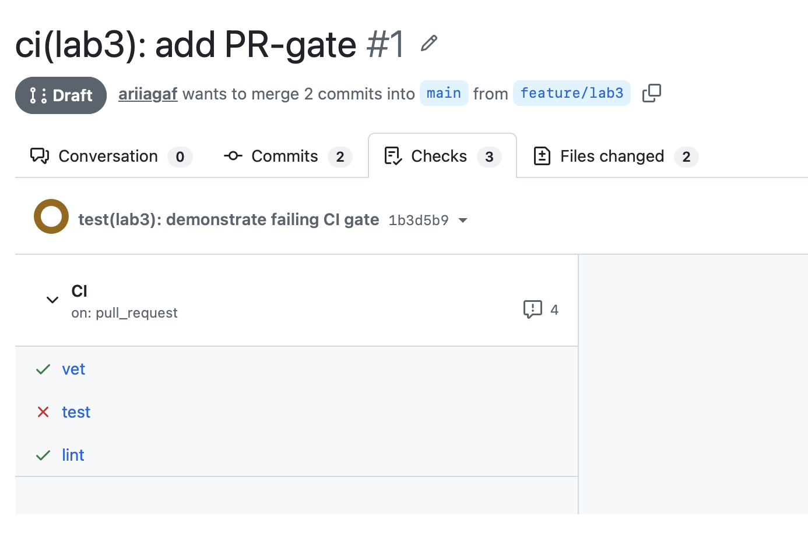
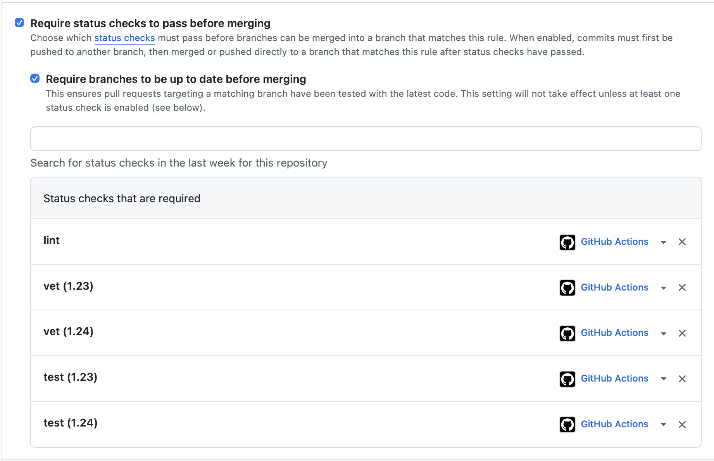
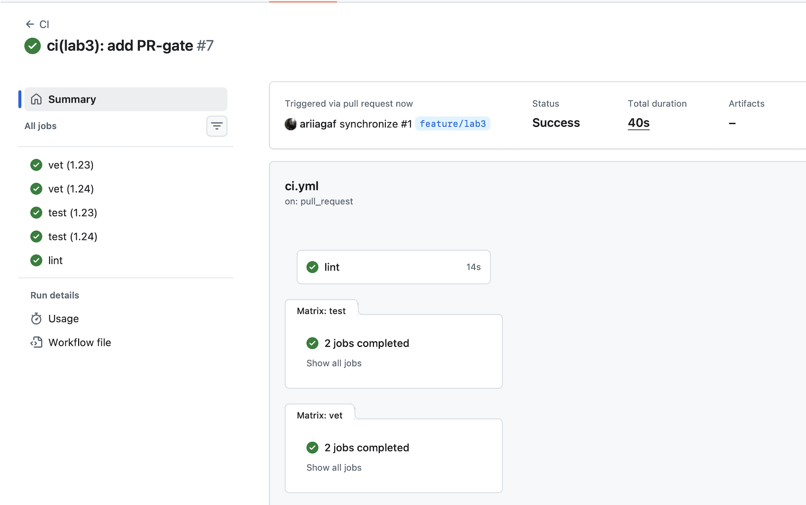

# Lab 3 — CI/CD: PR-Gated Pipeline for QuickNotes

## Chosen path

I chose GitHub Actions because the repository is hosted on GitHub and GitHub Actions integrates directly with pull requests and branch protection.

## Task 1 — PR Gate

### CI workflow

The workflow runs three independent jobs:

- `vet` — runs `go vet ./...`
- `test` — runs `go test -race -count=1 ./...`
- `lint` — runs `golangci-lint v2.5.0`

The workflow uses `ubuntu-24.04`, pinned GitHub Actions commits, and:

```yaml
permissions:
  contents: read
```

### Green CI run

Green CI run: https://github.com/ariiagaf/DevOps-Intro/actions/runs/35136714983

### Deliberate failure test

I deliberately changed the expected HTTP status in `TestCreateNote_RoundTrip` from `201 Created` to `200 OK`.

The CI result was:

- `vet` — passed
- `test` — failed
- `lint` — passed

Failing commit:

`1b3d5b9 test(lab3): demonstrate failing CI gate`



The test was restored in:

`9f55253 test(lab3): restore passing test`

After restoring the test, all checks passed again.

### Branch protection

Branch protection is enabled for `main`.

Required checks:

- `lint`
- `vet (1.23)`
- `vet (1.24)`
- `test (1.23)`
- `test (1.24)`

`Require branches to be up to date before merging` is enabled.



## Task 1 — Design questions

### a) Why pin the runner version instead of ubuntu-latest?

Pinning `ubuntu-24.04` makes the CI environment predictable. `ubuntu-latest` can move to a newer Ubuntu version in the future, which may change installed tools, libraries, package versions, or default system behavior. A pinned runner reduces unexpected CI failures caused by environment changes.

### b) Why split vet, test, and lint into separate jobs?

Separate jobs run independently and can execute in parallel. They also make failures easier to diagnose because the PR clearly shows whether the problem is in static analysis, tests, or linting.

With one combined job, the commands would usually run sequentially. If the first command failed, later checks might never run, and the pipeline would give less information.

### c) What attack does SHA pinning prevent?

SHA pinning protects against supply-chain attacks where a mutable GitHub Action tag is changed to point to malicious code.

A relevant example is the `tj-actions/changed-files` supply-chain compromise disclosed on March 14, 2025. The compromised action could execute malicious code in GitHub Actions runners and expose secrets from the CI environment.

Pinning an action to a full 40-character commit SHA makes the referenced code immutable, so silently moving a version tag to compromised code does not change what the workflow executes.

### d) What is permissions: and what principle is behind it?

`permissions:` controls what the automatically generated `GITHUB_TOKEN` can access during a workflow.

Using:

```yaml
permissions:
  contents: read
```

gives the workflow only read access to repository contents.

This follows the principle of least privilege: give a process only the permissions it actually needs.

### e) GitLab stages and jobs

Not applicable to my implementation because I chose the GitHub Actions path.

In GitLab CI, a stage defines an execution phase, while a job is a specific unit of work inside a stage. Jobs in the same stage can normally run in parallel, while later stages wait for earlier stages to complete.

`dependencies:` controls which previous jobs a job downloads artifacts from; it does not define execution order in the same way that `stages:` does.

## Task 2 — Cache, matrix, and path filter

### Cache

Go caching was enabled through `actions/setup-go`.

The cache key is based on:

```text
app/go.mod
```

QuickNotes has no third-party Go dependencies, so caching produced almost no improvement. This is expected because there is very little dependency data to restore.

### Build matrix

`vet` and `test` run against:

- Go 1.23
- Go 1.24

The matrix uses:

```yaml
fail-fast: false
```

so one failing matrix job does not cancel the other versions.



### Docs-only path filter

The workflow only runs when these paths change:

```text
app/**
.github/workflows/ci.yml
```

A separate PR containing only a `README.md` change did not start the CI workflow.

## Timing measurements

| Scenario | Wall-clock |
|---|---:|
| Baseline — no cache, one Go version | 33 s |
| With cache | 32 s |
| With cache + matrix | 39 s |

The cache saved almost no time because QuickNotes has no external Go dependencies. The matrix increased total wall-clock time only slightly because the jobs run in parallel.

## Task 2 — Design questions

### f) Why cache dependency inputs instead of build outputs?

Dependency inputs are deterministic because they are tied to dependency metadata such as `go.mod` or `go.sum`.

Build outputs can depend on the operating system, compiler version, build flags, architecture, and other environment details. Reusing incompatible build outputs can produce incorrect or confusing results.

### g) What does fail-fast: false change?

With `fail-fast: false`, all matrix jobs continue running even if one version fails.

This is useful because we want to know exactly which Go versions pass or fail.

`fail-fast: true` is useful when the remaining jobs are expensive and there is little value in continuing after the first failure.

### h) What is the cache poisoning risk?

Cache poisoning happens when an attacker manages to place malicious or modified files into a CI cache and a trusted workflow later restores that cache.

This can be dangerous because cached files may later be used or executed by a workflow with greater privileges.

GitHub restricts cache access between branches and workflow contexts to reduce this risk. Cache contents should still be treated as potentially untrusted, and secrets should never be stored in caches.
