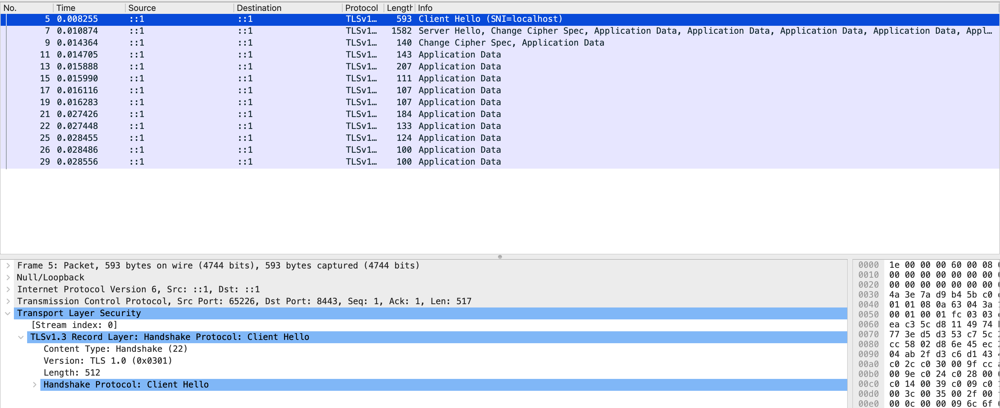
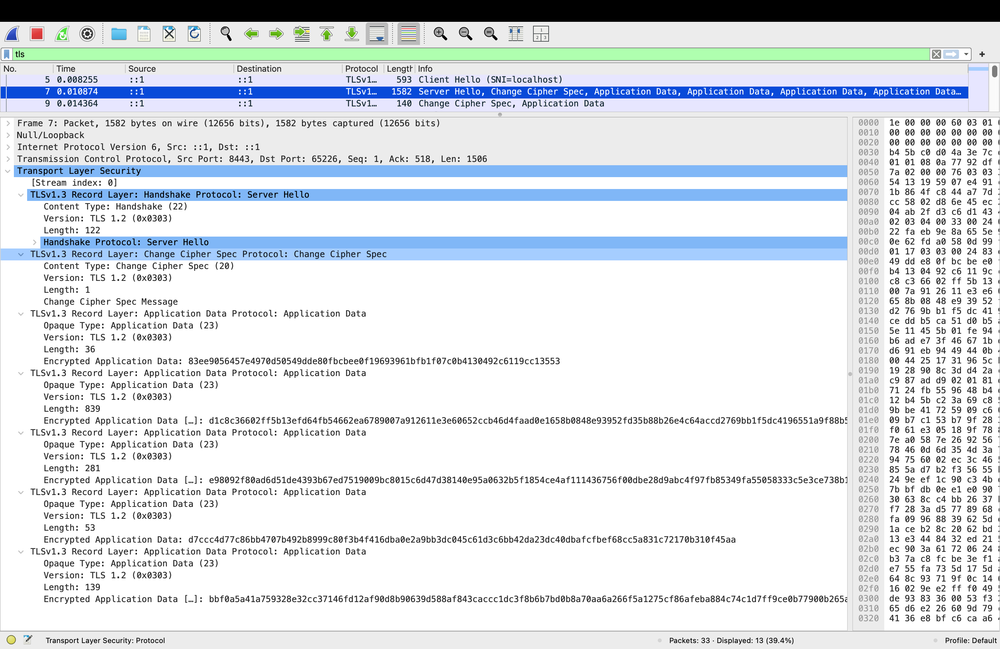

# Lab 4 — OS & Networking

## Environment

This lab was completed on macOS. Because some commands in the lab are Linux-specific, I used equivalent macOS commands where necessary:

- `lsof` instead of `ss`
- `netstat -rn` instead of `ip route show`
- `log show` instead of `journalctl`
- `pfctl` instead of `iptables` / `nft`
- loopback interface `lo0` instead of `lo`

## Task 1 — Trace a Request End-to-End

### Packet capture

QuickNotes was started locally on port `8080`.

The packet capture was created with:

```bash
sudo tcpdump -i lo0 -nn -s 0 -A 'tcp port 8080' -w lab4-trace.pcap
```

The request was sent with:

```bash
curl -v -X POST http://localhost:8080/notes \
  -H 'Content-Type: application/json' \
  -d '{"title":"trace me","body":"in flight"}'
```

The capture was decoded with:

```bash
tcpdump -r lab4-trace.pcap -nn -A | tee lab4-trace.txt
```

### TCP three-way handshake

```text
23:12:53.784753 Flags [S]   -> SYN
23:12:53.784841 Flags [S.]  -> SYN/ACK
23:12:53.784862 Flags [.]   -> ACK
```

This establishes the TCP connection before HTTP data is sent.

### HTTP request

```text
POST /notes HTTP/1.1
Host: localhost:8080
User-Agent: curl/8.16.0
Accept: */*
Content-Type: application/json
Content-Length: 39

{"title":"trace me","body":"in flight"}
```

### HTTP response

```text
HTTP/1.1 201 Created
Content-Type: application/json
Date: Wed, 16 Sep 2026 20:12:53 GMT
Content-Length: 90

{"id":6,"title":"trace me","body":"in flight","created_at":"2026-09-16T20:12:53.785282Z"}
```

### TCP connection close

```text
23:12:53.786249 Flags [F.]  -> client FIN
23:12:53.786291 Flags [.]   -> ACK
23:12:53.786313 Flags [F.]  -> server FIN
23:12:53.786362 Flags [.]   -> final ACK
```

## Task 1 — Debugging commands

### 1. What is listening on port 8080?

Command:

```bash
lsof -nP -iTCP:8080 -sTCP:LISTEN
```

Output:

```text
COMMAND     PID           USER   FD   TYPE             DEVICE SIZE/OFF NODE NAME
quicknote 98279 arinaagafonova    5u  IPv6 0xc34ab088b2601437      0t0  TCP *:8080 (LISTEN)
```

Decision:

QuickNotes is running and listening on TCP port `8080`.

### 2. Host routes

Command:

```bash
netstat -rn
```

Relevant output:

```text
default            192.168.0.1        UGScIg                en0
127.0.0.1          127.0.0.1          UH                    lo0
```

Decision:

The host has a default route and a valid loopback route for localhost traffic.

### 3. Reachability

Command:

```bash
sudo mtr -rwc 5 localhost
```

Output:

```text
Start: 2026-09-16T23:17:41+0300
HOST: MacBook-Pro-Arina-3.local Loss%   Snt   Last   Avg  Best  Wrst StDev
1.|-- localhost                  0.0%     5    0.1   0.1   0.1   0.1   0.0
```

Decision:

Localhost is reachable with `0%` packet loss and approximately `0.1 ms` latency.

### 4. DNS

Command:

```bash
dig +short example.com @1.1.1.1
```

Output:

```text
172.66.147.243
104.20.23.154
```

Decision:

DNS resolution through resolver `1.1.1.1` is working.

### 5. Logs

Command:

```bash
log show --last 5m --predicate 'process == "quicknotes"' 2>/dev/null | tail -20
```

Output:

```text
Timestamp                       Thread     Type        Activity             PID    TTL
```

Decision:

No useful service logs were found. QuickNotes was started manually with `go run`, not as a system service, so there was no equivalent `journalctl` service log to inspect.

## What would I check first if QuickNotes returned 502?

If QuickNotes returned `502 Bad Gateway`, I would first verify whether the backend process is actually running and listening on the expected port. I would then check whether the reverse proxy can reach `localhost:8080`, followed by routing, firewall rules, and DNS only if the earlier checks looked correct. A `502` usually means the proxy itself is reachable but cannot get a valid response from its upstream backend, so checking the backend listener and connectivity comes first.

## Task 2 — Outside-In Debugging on a Broken Deploy

### Reproducing the failure

I deliberately attempted to start another QuickNotes instance on the already occupied port `8080`.

The failed process produced:

```text
2026/09/16 23:20:08 listen: listen tcp :8080: bind: address already in use
exit status 1
```

This confirmed that the root cause was a port conflict.

### Outside-in debugging chain

#### 1. Is the process running?

Command:

```bash
ps -ef | grep -E "quicknotes|go run" | grep -v grep
```

Output:

```text
501 98275 96713   0 11:14   ttys010    0:00.36 go run .
501 98279 98275   0 11:14   ttys010    0:00.01 /Users/arinaagafonova/Library/Caches/go-build/.../quicknotes
```

Decision:

A QuickNotes process was already running.

#### 2. Is it listening on port 8080?

Command:

```bash
lsof -nP -iTCP:8080 -sTCP:LISTEN
```

Output:

```text
COMMAND     PID           USER   FD   TYPE             DEVICE SIZE/OFF NODE NAME
quicknote 98279 arinaagafonova    5u  IPv6 0xc34ab088b2601437      0t0  TCP *:8080 (LISTEN)
```

Decision:

Port `8080` was already occupied by the existing QuickNotes instance.

#### 3. Is the service reachable from the host?

Command:

```bash
curl -s -o /dev/null -w "%{http_code}\n" http://localhost:8080/health
```

Output:

```text
200
```

Decision:

The already-running instance was healthy and reachable.

#### 4. Is the firewall blocking the connection?

Command:

```bash
sudo pfctl -sr
```

Output:

```text
No ALTQ support in kernel
ALTQ related functions disabled
scrub-anchor "com.apple/*" all fragment reassemble
anchor "com.apple/*" all
```

Decision:

There was no evidence that the local firewall was blocking traffic to QuickNotes.

#### 5. Does localhost resolve correctly?

Commands:

```bash
dig +short localhost
dscacheutil -q host -a name localhost
```

Output:

```text
;; connection timed out; no servers could be reached

name: localhost
ipv6_address: ::1

name: localhost
ip_address: 127.0.0.1
```

Decision:

`dig` did not resolve `localhost` through DNS, but the macOS local resolver correctly mapped `localhost` to both `::1` and `127.0.0.1`.

### Repair and re-verification

The process occupying port `8080` was stopped. Because `go run` had left the compiled child process running, I terminated the child process that actually owned the listening socket.

After the port was free, QuickNotes was started again:

```bash
ADDR=:8080 go run . &
NEW_PID=$!
sleep 1
```

Health verification:

```bash
curl -s http://localhost:8080/health
```

Output:

```json
{"notes":6,"status":"ok"}
```

Port verification:

```bash
lsof -nP -iTCP:8080 -sTCP:LISTEN
```

Output:

```text
COMMAND    PID           USER   FD   TYPE             DEVICE SIZE/OFF NODE NAME
quicknote 5060 arinaagafonova    5u  IPv6 0x4c9ebb2a5d37f3aa      0t0  TCP *:8080 (LISTEN)
```

The service was healthy after the conflicting process was removed.

### Root cause

The root cause was:

```text
bind: address already in use
```

Another QuickNotes process was already bound to TCP port `8080`, so the new instance could not start.

### Mini-postmortem

This failure was caused by two application instances attempting to bind to the same TCP port. The problem is systemic because manual process management makes it easy to leave an old instance running and start another without checking port ownership first. A service manager such as systemd, launchd, or a container orchestrator could prevent duplicate instances and provide clearer process lifecycle management. Startup checks and automated health verification could also detect the conflict immediately. The failure was not caused by a single person; it came from the deployment process lacking safeguards around process and port ownership.

## Bonus — TLS Handshake Analysis

QuickNotes was placed behind a local Caddy reverse proxy using HTTPS on port `8443`.

The HTTPS traffic was captured with `tcpdump` and inspected in Wireshark. The capture shows both the TLS `Client Hello` and `Server Hello` handshake messages.





The negotiated connection parameters were:

- TLS version: TLS 1.3
- Cipher suite: `TLS_AES_128_GCM_SHA256`
- Temporary key exchange: X25519
- Server certificate subject: `CN=localhost`
- Server certificate issuer: `CN=localhost`
- Public key: RSA 2048 bit
- Signature algorithm: RSA-SHA256
- Certificate validity:
  - Not Before: Sep 16 20:35:05 2026 GMT
  - Not After: Sep 17 20:35:05 2026 GMT

The certificate chain contains one locally generated self-signed certificate. Because the subject and issuer are both `CN=localhost`, the certificate is its own issuer.

Wireshark displays TLS 1.0 / TLS 1.2 values in some record-layer version fields for compatibility. The actual negotiated protocol is TLS 1.3, as indicated by the TLS 1.3 handshake and confirmed with `openssl s_client`.

`openssl s_client` reported:

```text
New, TLSv1.3, Cipher is TLS_AES_128_GCM_SHA256
subject=CN = localhost
issuer=CN = localhost
Server public key is 2048 bit
```

The verification warning is expected because the certificate is self-signed and was created only for this local lab environment.
